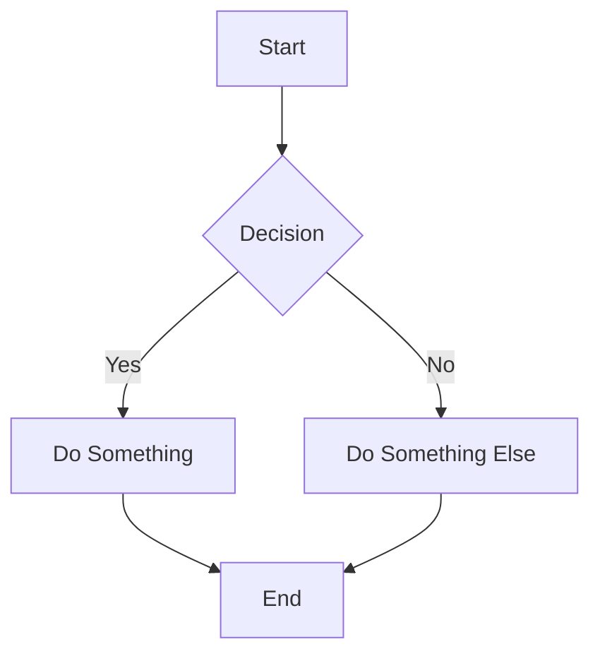
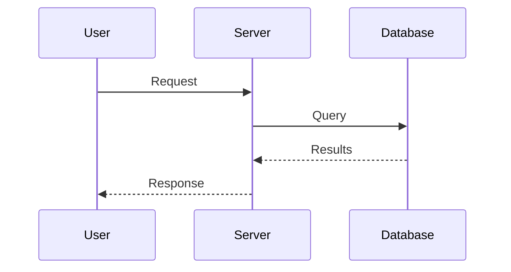

# Content Creation Guide

This guide covers everything you need to know about creating and managing content on **The Margin**.

---

## Quick Start: Creating Your First Post

1. Create a new `.md` file in `website_content/`
2. Add frontmatter (YAML header)
3. Write your content in Markdown
4. Run `pnpm dev` to preview

### Example Post Structure

```markdown
---
title: My First Post
description: A brief description for SEO and social sharing.
date: 2024-12-28
tags:
  - llm-research
  - mathematics
draft: false
---

# Introduction

Your content goes here...
```

---

## Frontmatter Options

Frontmatter is the YAML block at the top of each file between `---` markers.

| Field | Type | Description |
|-------|------|-------------|
| `title` | string | Page title (required) |
| `description` | string | SEO description, shown in previews |
| `date` | date | Publication date (YYYY-MM-DD) |
| `lastmod` | date | Last modified date |
| `tags` | list | Tags for categorization |
| `aliases` | list | Alternative URLs (e.g., `/about`) |
| `draft` | boolean | If `true`, won't be published |
| `hide_metadata` | boolean | Hide date/reading time |
| `permalink` | string | Custom URL slug |

### Example with All Options

```yaml
---
title: Understanding Transformer Architectures
description: A deep dive into attention mechanisms and their mathematical foundations.
date: 2024-12-28
lastmod: 2024-12-30
tags:
  - llm-research
  - deep-learning
  - mathematics
aliases:
  - /transformers
  - /attention-mechanisms
draft: false
permalink: transformer-deep-dive
---
```

---

## Wiki-Style Backlinks (Like Gwern)

Quartz supports **Obsidian-style wikilinks** for powerful backlink functionality.

### Basic Wikilinks

```markdown
Link to another page: [[page-name]]

Link with custom text: [[page-name|Display Text]]

Link to section: [[page-name#section-heading]]

Link to section with text: [[page-name#section|Custom Text]]
```

### Examples

```markdown
See my [[about-me|About page]] for more info.

This connects to [[llm-research#attention-mechanisms]].

Related: [[mathematics]], [[theology]], [[personal-reflections]]
```

### How Backlinks Work

- When you link from page A to page B using `[[page-b]]`, Quartz automatically:
  1. Creates a clickable link to page B
  2. Shows page A in page B's "Backlinks" section
  3. Creates hover previews (popovers) on desktop

### Tips for Effective Linking

1. **Link liberally** - Connect related ideas across posts
2. **Use descriptive aliases** - `[[complex-topic|this concept]]` reads better
3. **Create hub pages** - Index pages that link to related content
4. **Check backlinks** - Review what links to each page in the footer

---

## Images

### Basic Image Syntax

```markdown

```

### Wikilink Image Embeds

```markdown
![[image-name.png]]

With alt text:
![[image-name.png|Alt text here]]

With dimensions:
![[image-name.png|400x300]]

With alt and dimensions:
![[image-name.png|Alt text|400x300]]
```

### External Images

```markdown

```

### Image Best Practices

1. **Always add alt text** - For accessibility and SEO
2. **Use AVIF/WebP** - Better compression than PNG/JPEG
3. **Store images** in `quartz/static/images/`
4. **Reference with** `/static/images/filename.png`

---

## Videos

### Embed Local Videos

```markdown
![[video-name.mp4]]
```

Or with standard Markdown:

```markdown

```

### YouTube Embeds

Simply paste the YouTube URL as an image:

```markdown

```

This automatically converts to an embedded YouTube player!

---

## Code Blocks

### Syntax Highlighting

````markdown
```python
def hello_world():
    print("Hello from The Margin!")
```
````

### Supported Languages

Python, JavaScript, TypeScript, Rust, Go, SQL, Bash, CSS, HTML, JSON, YAML, and many more.

### Inline Code

```markdown
Use `backticks` for inline code like `function_name()`.
```

---

## Math (LaTeX/KaTeX)

### Inline Math

```markdown
The equation $E = mc^2$ changed physics.
```

### Block Math

```markdown
$$
\int_{-\infty}^{\infty} e^{-x^2} dx = \sqrt{\pi}
$$
```

### Complex Equations

```markdown
$$
\nabla \times \mathbf{E} = -\frac{\partial \mathbf{B}}{\partial t}
$$
```

---

## Admonitions (Callout Boxes)

Create colored callout boxes for important content:

### Syntax

```markdown
> [!note]
> This is a note admonition.

> [!warning]
> This is a warning!

> [!tip]
> Here's a helpful tip.
```

### Available Types

| Type | Aliases | Use For |
|------|---------|---------|
| `note` | - | General information |
| `abstract` | `summary`, `tldr` | Summaries |
| `info` | - | Informational content |
| `tip` | `hint`, `important` | Helpful tips |
| `success` | `check`, `done` | Success messages |
| `question` | `help`, `faq` | Questions |
| `warning` | `attention`, `caution` | Warnings |
| `failure` | `fail`, `missing` | Failures |
| `danger` | `error` | Critical warnings |
| `bug` | - | Bug reports |
| `example` | - | Examples |
| `quote` | `cite` | Quotations |

### Collapsible Admonitions

```markdown
> [!note]+
> This starts expanded but can be collapsed.

> [!warning]-
> This starts collapsed.
```

### Custom Titles

```markdown
> [!tip] Pro Tip: Save Time!
> Content here...
```

---

## Tags

### Adding Tags

In frontmatter:
```yaml
tags:
  - llm-research
  - mathematics
  - theology
```

Or inline:
```markdown
This post is about #llm-research and #mathematics.
```

### Tag Pages

- Each tag gets an automatic page at `/tags/tag-name`
- The "All Tags" page lists all tags
- Tags show hierarchies with `/`: `#research/alignment`

---

## Highlights

Highlight text with double equals:

```markdown
This is ==highlighted text== in your content.
```

---

## Spoilers

Hide content until clicked:

```markdown
> ! This is hidden spoiler content.
> ! Click to reveal it.
```

---

## Tables

### Basic Tables

```markdown
| Header 1 | Header 2 | Header 3 |
|----------|----------|----------|
| Cell 1   | Cell 2   | Cell 3   |
| Cell 4   | Cell 5   | Cell 6   |
```

### Aligned Tables

```markdown
| Left | Center | Right |
|:-----|:------:|------:|
| L    |   C    |     R |
```

---

## Block References

Reference specific blocks in other pages:

### Create a Block ID

```markdown
This is a paragraph with a block reference. ^block-id
```

### Reference the Block

```markdown
![[page-name#^block-id]]
```

---

## Transclusion (Embedding Content)

Embed content from other pages:

### Embed Entire Page

```markdown
![[other-page]]
```

### Embed Specific Section

```markdown
![[other-page#section-heading]]
```

### Embed Block

```markdown
![[other-page#^block-id]]
```

---

## Mermaid Diagrams

Create diagrams with Mermaid syntax:

````markdown

````

### Flowcharts, Sequence Diagrams, and More

````markdown

````

---

## Checkboxes

Create interactive checklists:

```markdown
- [ ] Unchecked item
- [x] Checked item
- [ ] Another task
```

---

## Footnotes

Add references with footnotes:

```markdown
Here's a statement that needs a citation[^1].

[^1]: This is the footnote content.
```

---

## Emojis

Emojis are rendered consistently with Twemoji:

```markdown
🎉 Celebrate! 🚀 Launch! 📝 Write!
```

---

## Content Organization Tips

### 1. Create a Clear Structure

```
website_content/
├── index.md          # Homepage
├── about-me.md       # About page
├── Posts.md          # Posts listing
├── research/         # Research posts
│   ├── llm-basics.md
│   └── attention.md
├── math/             # Math notes
│   ├── topology.md
│   └── algebra.md
└── reflections/      # Personal posts
    └── ...
```

### 2. Use Consistent Tagging

- Create a personal taxonomy
- Use hierarchical tags: `research/llm`, `math/topology`
- Review tag pages to ensure consistency

### 3. Link Everything

- Every post should have at least 2-3 internal links
- Create "hub" pages that collect related content
- Use backlinks to discover connections

### 4. Write Great Metadata

- Descriptive titles (50-60 characters)
- Clear descriptions (150-160 characters)
- Relevant tags
- Accurate dates

---

## Development Workflow

### Preview Your Site

```bash
cd /home/jonxpr/Documents/Personal/website/TurnTrout.com
pnpm dev
```

Visit http://localhost:8080

### Build for Production

```bash
pnpm build
```

### Format Code

```bash
pnpm format
```

---

## Advanced Features

### Custom Permalinks

```yaml
---
title: Complex Topic Explained
permalink: simple-url
---
```

Now accessible at `/simple-url` instead of `/complex-topic-explained`.

### Aliases (Multiple URLs)

```yaml
---
aliases:
  - /old-url
  - /alternate-path
---
```

### Table of Contents

A table of contents is automatically generated for posts with multiple headings.

### Reading Time

Automatically calculated based on word count.

### Link Favicons

External links automatically show site favicons.

### Hover Previews (Popovers)

Internal links show page previews on hover.

---

## Quick Reference

| Feature | Syntax |
|---------|--------|
| Wikilink | `[[page-name]]` |
| Wikilink with text | `[[page-name\|Display Text]]` |
| Image embed | `![[image.png]]` |
| Video embed | `![[video.mp4]]` |
| Highlight | `==text==` |
| Spoiler | `> ! hidden text` |
| Inline math | `$equation$` |
| Block math | `$$equation$$` |
| Admonition | `> [!type]` |
| Checkbox | `- [ ]` or `- [x]` |
| Footnote | `[^1]` |
| Tag | `#tag-name` |
| Block ref | `^block-id` |
| Transclude | `![[page#section]]` |

---

*Happy writing! 📝*
